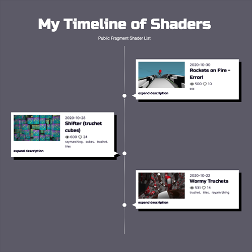
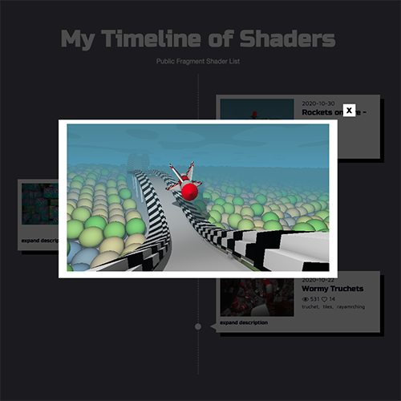

# Shader Timeline with React.js

Simple React.js based timeline - using 'useLayoutEffect' to create a hook that helps the app determin what items are on screen and animates them in or out. The site itself lists my shaders that I have created on [Shadertoy.com](https://www.shadertoy.com/user/pjkarlik)

You can click one of the itemline items to expand the description and also open a modal view to an active rendering of my shader. The shaders both list and code are using ShaderToy's DB API - so may be slow at times.

## Run the example

Check your browser [WebGL support](https://caniuse.com/webgl2).

Requires Node v12.xx.xx or greater

```bash
$ npm install
$ npm start
```

open http://localhost:2020/
